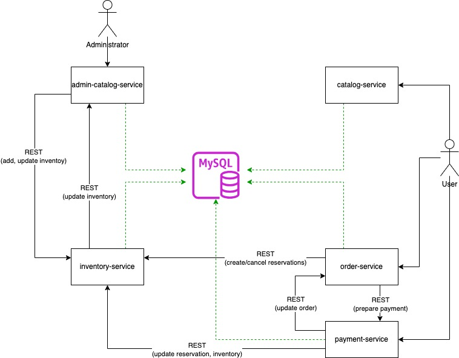
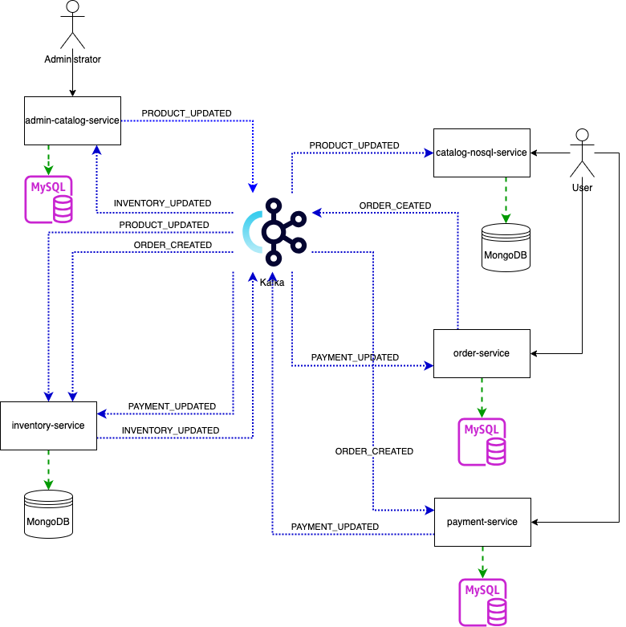

# Microservice Architecture: master's thesis examples
Master's thesis examples

## Overview
This repository contains the code examples used in the master's thesis titled "Arhitekturni vzorci v mikrostoritvenih sistemih" (Architectural Patterns in Microservice Systems). The projects demonstrate various microservice arhitectural patterns and communication protocols discussed in the thesis.

For analysis purposes, the system implements duplicate operations: one exposed via a REST API, and the other through event publishing to Kafka. This allows for a comparison between event-driven architecture (EDA) and a traditional synchronous flow. The diagrams below illustrate both approaches:

#### Synchronous, RESTfull Flow

#### Asynchronous, Event-driven Flow

## Services
### Admin Catalog service
The Admin Catalog Service handles core administrative operations in the e-commerce system. It provides RESTful endpoints for performing CRUD operations on products, categories, brands, tags, and specifications. The service uses a MySQL database for data storage and runs on the Quarkus framework.

### Catalog service
The Catalog Service is responsible for retrieving product information. It offers multiple endpoints using REST API, GraphQL, and gRPC protocols to fetch product data. These different communication protocols were analyzed and compared in the thesis to explore their performance and applicability. The service shares a MySQL database with the Admin Catalog Service and is also built on the Quarkus framework.

### Catalog nosql service
This service mirrors the functionality of the Catalog Service but utilizes a MongoDB database with a modified product model. Data synchronization between the Admin Catalog Service and the Catalog NoSQL Service is handled via Kafka messaging. The purpose of this service is to demonstrate Event-Driven Architecture (EDA), analyze the CQRS (Command Query Responsibility Segregation) pattern, and compare it with traditional approaches using a shared database.

### Catalog Search service
The Catalog Search Service is similar to the Catalog NoSQL Service, but instead of MongoDB, it uses Elasticsearch for data storage. It is also synchronized with Kafka and serves as another demonstration of the CQRS pattern.

## Order Service

## Payment Service

## Inventory Service

## Infrastructure
This repository includes an infrastructure project that provides a Docker Compose script to set up the necessary environment for all services. The script simplifies the process of running and managing the entire system.

## Tests
A separate repository is available containing k6 test scripts. These tests were used to evaluate different communication protocols and architectural patterns described in the master's thesis.